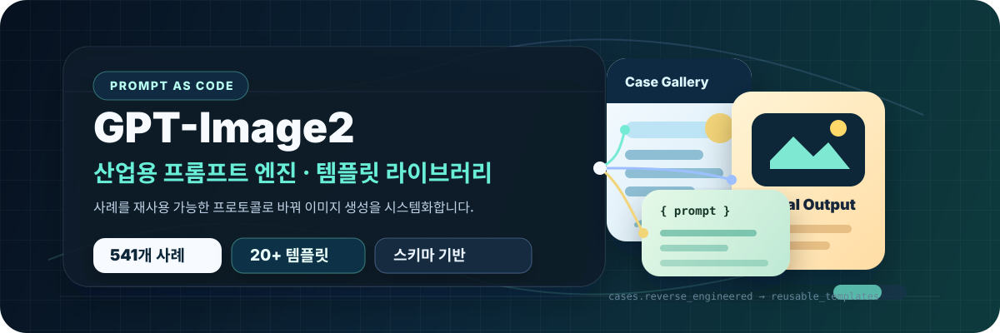

<p align="center"></p>

<h3 align="center">Prompt as Code | GPT-Image2 産業レベルのプロンプトエンジンとテンプレートライブラリ、541 件のリバースエンジニアリング事例、20+ 種の実務向けテンプレート</h3>

<p align="center">
  <a href="https://github.com/freestylefly/awesome-gpt-image-2"></a>
  <a href="https://github.com/freestylefly/awesome-gpt-image-2"></a>
  <a href="https://github.com/freestylefly/awesome-gpt-image-2"></a>
  <a href="https://github.com/freestylefly/awesome-gpt-image-2"></a>
</p>

<p align="center">
  <a href="https://trendshift.io/repositories/28623?utm_source=repository-badge&amp;utm_medium=badge&amp;utm_campaign=badge-repository-28623">
    
  </a>
</p>

<p align="center">
  <a href="./README.md">Korean</a> | <a href="./README.en.md">English</a> | <a href="./README.zh-CN.md">简体中文</a> | <strong>日本語</strong>
</p>

## 🌐 ビジュアル Web サイト

[gpt-image2.canghe.ai](https://gpt-image2.canghe.ai/) では、プロダクトとして整備された体験でギャラリーを閲覧できます。大きなプレビューの確認、プロンプト全文のコピー、スタイルやシナリオによる絞り込み、Google ログイン後の生成テスト、GitHub 上の元ケースへの移動ができます。

<p align="center">
  <a href="https://gpt-image2.canghe.ai/">
    
  </a>
</p>

## コミュニティ

GPT-Image2 コミュニティに参加して、ほかのユーザーとプロンプト、制作方法、活用事例を共有できます。参加方法は[コミュニティページ](https://gpt-image2.canghe.ai/community)をご覧ください。

WeChat 公式アカウント **苍何(Canghe)** をフォローするか、下の QR コードをスキャンすると、プロジェクトの更新、新しい事例、実用的なチュートリアルを受け取れます。

<p align="center">
  
</p>

## ❤️ スポンサー

> [ここに掲載したい方へ](data/images/sponsors/wechat-personal.jpg) GitHub Sponsors でプロジェクトを支援するか、上記の WeChat 公式アカウントをフォローして、製品名と短いスポンサー説明を送ってください。

| スポンサー | 説明 |
| ---------- | ---- |
| <a href="https://apimart.ai/register?aff=oQgzUQ"></a> | APIMart による本プロジェクトへのサポートに感謝します。APIMart は AI 画像/動画生成に特化した低価格 API プラットフォームで、GPT-Image-2 を `$0.006/image` から利用でき、1 ドルで 160 枚以上の画像を生成できます。画像と動画をひとつの非同期 API で扱い、タスク送信後に ID を受け取り、ポーリングまたはコールバックで結果を取得できます。数万枚規模のバッチ生成でもタイムアウトを抑え、モデル変更時もコードを書き換えずに対応できます。従量課金で月額料金はありません。[こちらから登録](https://apimart.ai/register?aff=oQgzUQ)して利用を始められます。 |
| <a href="https://www.hiapi.ai/zh/register?aff=DzuH"></a> | hiapi による本プロジェクトへのサポートに感謝します。hiapi は AI 画像/動画生成 API プラットフォームで、GPT-Image-2（テキストから画像、画像編集、1K–4K）に加えて Seedance、Kling、Wan などの動画モデルも、ひとつの統一非同期 API で扱えます。タスクを送信して `task_id` を受け取り、ポーリングまたはコールバックで結果を取得でき、バッチ処理でもタイムアウトしにくく、モデル変更時もコードを書き換えずに対応できます。生成結果は hiapi 独自 CDN に保存され、**永続ストレージ**に対応しているため、画像/動画 URL を長期的に利用でき、急いで自分でダウンロードしてバックアップする必要がありません。Remote MCP と Agent Skills をネイティブに備え、Claude Code と Cursor にそのまま接続できます。中国語 UI とドキュメント、WeChat Pay、従量課金、月額料金なし。新規ユーザーには $1 の無料クレジット（約 50 枚分）が付与されます。[こちらから登録](https://www.hiapi.ai/zh/register?aff=DzuH&utm_source=github&utm_medium=sponsor&utm_campaign=awesome-gpt-image-2)して利用を始められます。 |
| <a href="https://www.packyapi.ai/register?aff=CV0c"></a> | PackyCode による本プロジェクトへのサポートに感謝します。PackyCode は Claude Code、Codex、Gemini などに対応する、安定性と処理性能に優れた API リレープロバイダーです。自動フェイルオーバー、スマートルーティング、無制限の同時実行により、AI コーディングの生産性を高めます。[こちらから登録](https://www.packyapi.ai/register?aff=CV0c)して利用を始められます。 |
| <a href="https://pptoken.cc/"></a> | プロジェクトスポンサー。PPToken は ChatGPT、Claude、Gemini など主要 AI モデル向けの API リレーとキー配布を提供し、低遅延、高可用性、従量課金、柔軟なサブスクリプションに対応しています。 |

<a name="section-vision"></a>

## ⚡️ プロジェクトビジョン

GPT-Image2 が広く利用できるようになったことで、AI 画像生成の焦点は「画像を生成できるか」から「安定し、制御でき、再利用できる画像を生成できるか」へ移りました。本プロジェクトは、コミュニティに散在する事例を、Agent や自動化ワークフローから再利用しやすい Prompt-as-Code アセットへ整理することを目的としています。

中心となる目標は明快です。散文的なプロンプトを、構造化されたプロトコルへ圧縮すること。バッチ生成、テンプレートシステム、本番ワークフローへの組み込みが必要な場面では、個別事例を集めるだけよりも、この構造化のほうが大きな価値を持ちます。

- 🧱 アトミック Schema：主体、光、素材、レイアウト、視覚ディテールを組み合わせ可能な部品へ分解
- ⚙️ ワークフロー親和性：Agent、スクリプト、自動化システムで扱いやすい設計
- 🧬 構造化制御：レイアウト、コピー、情報階層の制御性を高める構成

## 📖 クイックリンク

- [ケースギャラリー全体](docs/gallery.md)
- [Gallery Part 1：ケース 1-165](docs/gallery-part-1.md)
- [Gallery Part 2：ケース 166-544](docs/gallery-part-2.md)
- [産業向けプロンプトテンプレートと落とし穴ガイド](docs/templates.md#section-templates)
- [Agent Skill：GPT-Image2 Style Library](agents/skills/gpt-image-2-style-library/SKILL.md)
- [MIT License](LICENSE)
- [免責事項全文](docs/disclaimer.md#section-disclaimer)

## 🗂️ カテゴリ概要

まずケースアルバムで目指すビジュアル方向を見つけ、その後プロンプトテンプレートのカテゴリを開いて、再利用可能な構造へ落とし込みます。

### 🖼️ ケースアルバム

<table>
  <tr>
    <td width="33%" valign="top" align="center">
      <p><strong>🧩 UI とインターフェース</strong><br><sub>73 cases</sub></p>
      <a href="docs/gallery.md#cat-ui"></a><br>
      <sub>アプリ、Web サイト、ダッシュボード、SNS スクリーンショット、プロダクト UI。</sub><br>
      <a href="docs/gallery.md#cat-ui"><strong>ケースを見る</strong></a>
    </td>
    <td width="33%" valign="top" align="center">
      <p><strong>📊 チャートとインフォグラフィック</strong><br><sub>53 cases</sub></p>
      <a href="docs/gallery.md#cat-infographic"></a><br>
      <sub>インフォグラフィック、ナレッジマップ、技術解説、構造化図解。</sub><br>
      <a href="docs/gallery.md#cat-infographic"><strong>ケースを見る</strong></a>
    </td>
    <td width="33%" valign="top" align="center">
      <p><strong>📰 ポスターとタイポグラフィ</strong><br><sub>90 cases</sub></p>
      <a href="docs/gallery.md#cat-poster"></a><br>
      <sub>イベントポスター、カバー、文字主体のビジュアル、強いレイアウト構成。</sub><br>
      <a href="docs/gallery.md#cat-poster"><strong>ケースを見る</strong></a>
    </td>
  </tr>
  <tr>
    <td width="33%" valign="top" align="center">
      <p><strong>🛍️ 商品と E コマース</strong><br><sub>42 cases</sub></p>
      <a href="docs/gallery.md#cat-product"></a><br>
      <sub>商品カット、詳細ページ、パッケージ、訴求ポイント、広告表現。</sub><br>
      <a href="docs/gallery.md#cat-product"><strong>ケースを見る</strong></a>
    </td>
    <td width="33%" valign="top" align="center">
      <p><strong>🏷️ ブランドとロゴ</strong><br><sub>27 cases</sub></p>
      <a href="docs/gallery.md#cat-brand"></a><br>
      <sub>ロゴ、アイデンティティシステム、ブランド接点、キャンペーンビジュアル。</sub><br>
      <a href="docs/gallery.md#cat-brand"><strong>ケースを見る</strong></a>
    </td>
    <td width="33%" valign="top" align="center">
      <p><strong>🏛️ 建築と空間</strong><br><sub>12 cases</sub></p>
      <a href="docs/gallery.md#cat-architecture"></a><br>
      <sub>建築レンダリング、インテリア、都市地図、空間コンセプト。</sub><br>
      <a href="docs/gallery.md#cat-architecture"><strong>ケースを見る</strong></a>
    </td>
  </tr>
  <tr>
    <td width="33%" valign="top" align="center">
      <p><strong>📷 写真とリアリズム</strong><br><sub>78 cases</sub></p>
      <a href="docs/gallery.md#cat-photo"></a><br>
      <sub>ポートレート、スマートフォン写真、フィルム質感、商業写真。</sub><br>
      <a href="docs/gallery.md#cat-photo"><strong>ケースを見る</strong></a>
    </td>
    <td width="33%" valign="top" align="center">
      <p><strong>🎨 イラストとアート</strong><br><sub>59 cases</sub></p>
      <a href="docs/gallery.md#cat-illustration"></a><br>
      <sub>イラスト、アートスタイル、素材実験、装飾的な画面表現。</sub><br>
      <a href="docs/gallery.md#cat-illustration"><strong>ケースを見る</strong></a>
    </td>
    <td width="33%" valign="top" align="center">
      <p><strong>🧍 キャラクターと人物</strong><br><sub>31 cases</sub></p>
      <a href="docs/gallery.md#cat-character"></a><br>
      <sub>キャラクターデザイン、ポーズ資料、カード、3D トイ表現。</sub><br>
      <a href="docs/gallery.md#cat-character"><strong>ケースを見る</strong></a>
    </td>
  </tr>
  <tr>
    <td width="33%" valign="top" align="center">
      <p><strong>🎬 シーンとストーリーテリング</strong><br><sub>21 cases</sub></p>
      <a href="docs/gallery.md#cat-scene"></a><br>
      <sub>絵コンテ、物語性のあるシーン、ライブ配信フレーム、世界観構築。</sub><br>
      <a href="docs/gallery.md#cat-scene"><strong>ケースを見る</strong></a>
    </td>
    <td width="33%" valign="top" align="center">
      <p><strong>🏮 歴史と古典テーマ</strong><br><sub>16 cases</sub></p>
      <a href="docs/gallery.md#cat-history"></a><br>
      <sub>古典絵巻、歴史人物、伝統題材、詩詞のビジュアル化。</sub><br>
      <a href="docs/gallery.md#cat-history"><strong>ケースを見る</strong></a>
    </td>
    <td width="33%" valign="top" align="center">
      <p><strong>📚 ドキュメントと出版物</strong><br><sub>11 cases</sub></p>
      <a href="docs/gallery.md#cat-document"></a><br>
      <sub>ホワイトペーパー、マニュアル、百科図版、出版レイアウト。</sub><br>
      <a href="docs/gallery.md#cat-document"><strong>ケースを見る</strong></a>
    </td>
  </tr>
  <tr>
    <td width="33%" valign="top" align="center">
      <p><strong>🧪 その他のユースケース</strong><br><sub>28 cases</sub></p>
      <a href="docs/gallery.md#cat-other"></a><br>
      <sub>クリエイティブ実験、特殊タスク、複合ワークフロー、実務ケース。</sub><br>
      <a href="docs/gallery.md#cat-other"><strong>ケースを見る</strong></a>
    </td>
    <td width="33%" valign="top" align="center">
      <h4>🖼️ フルギャラリー</h4>
      <a href="docs/gallery.md"></a><br>
      <sub>全 541 件のケースをパートとカテゴリ別に閲覧できます。</sub><br>
      <a href="docs/gallery.md"><strong>ギャラリーを開く</strong></a>
    </td>
    <td width="33%" valign="top" align="center">
      <h4>⭐ 最新の事例</h4>
      <a href="docs/gallery-part-2.md#case-544"></a><br>
      <sub>リポジトリに新しく収録されたコミュニティ事例とワークフロー。</sub><br>
      <a href="docs/gallery-part-2.md#case-544"><strong>最新を見る</strong></a>
    </td>
  </tr>
</table>

### 🧩 プロンプトテンプレートカテゴリ

<details open>
<summary><strong>Template Page 1 / 4：デザインと情報</strong></summary>

| カテゴリ | テンプレート入口 | 中核機能 |
|---|---|---|
| 🧩 UI とインターフェース | [プロンプトを見る](docs/templates.md#tpl-ui) | コンポーネント、ページ階層、スクリーンショット質感 |
| 📊 チャートとインフォグラフィック | [プロンプトを見る](docs/templates.md#tpl-infographic) | モジュール、矢印、データ構造、可読性 |
| 📰 ポスターとタイポグラフィ | [プロンプトを見る](docs/templates.md#tpl-poster) | レイアウト、見出しシステム、人物、視覚的インパクト |

</details>

<details>
<summary><strong>Template Page 2 / 4：商業と空間</strong></summary>

| カテゴリ | テンプレート入口 | 中核機能 |
|---|---|---|
| 🛍️ 商品と E コマース | [プロンプトを見る](docs/templates.md#tpl-product) | 商品訴求、パッケージ、詳細ページ構成 |
| 🏷️ ブランドとロゴ | [プロンプトを見る](docs/templates.md#tpl-brand) | ロゴ、アイデンティティ、ブランド接点システム |
| 🏛️ 建築と空間 | [プロンプトを見る](docs/templates.md#tpl-architecture) | 透視、素材、屋内外のライティング |

</details>

<details>
<summary><strong>Template Page 3 / 4：イメージングとキャラクター</strong></summary>

| カテゴリ | テンプレート入口 | 中核機能 |
|---|---|---|
| 📷 写真とリアリズム | [プロンプトを見る](docs/templates.md#tpl-photo) | レンズ、ライティング、リアルな質感 |
| 🎨 イラストとアート | [プロンプトを見る](docs/templates.md#tpl-illustration) | 筆致、素材、アートスタイル |
| 🧍 キャラクターと人物 | [プロンプトを見る](docs/templates.md#tpl-character) | キャラクターデザイン、ポーズシート、一貫性 |

</details>

<details>
<summary><strong>Template Page 4 / 4：ナラティブと拡張</strong></summary>

| カテゴリ | テンプレート入口 | 中核機能 |
|---|---|---|
| 🎬 シーンとストーリーテリング | [プロンプトを見る](docs/templates.md#tpl-scene) | 絵コンテ、世界観構築、感情の流れ |
| 🏮 歴史と古典テーマ | [プロンプトを見る](docs/templates.md#tpl-history) | 王朝、服飾、絵巻形式の語り |
| 📚 ドキュメントと出版物 | [プロンプトを見る](docs/templates.md#tpl-document) | ページシステム、目次、レイアウト規則 |
| 🧪 その他のユースケース | [プロンプトを見る](docs/templates.md#tpl-other) | 複合タスク、実験的ワークフロー、特殊出力 |

</details>

## 🤖 Agent Skill

このリポジトリには、Web サイトと同じデータを使って GPT-Image2 のスタイル、テンプレート、カテゴリ、シーンタグを選定するための Agent Skill が含まれています。

パッケージリンク：[npm](https://www.npmjs.com/package/gpt-image-2-style-library) / [GitHub Packages](https://github.com/freestylefly/awesome-gpt-image-2/pkgs/npm/gpt-image-2-style-library)

<p align="center">
  
</p>

<p align="center"><sub>Style Library Skill を使った city-life-system-map リクエストの出力例。</sub></p>

### Agent Skill のクイックインストール

Claude Code、Codex、Cursor、および [`skills`](https://www.npmjs.com/package/skills) が対応するその他のツールには、次の方法を推奨します。

```bash
npx skills add freestylefly/awesome-gpt-image-2 --skill gpt-image-2-style-library --agent claude-code codex --global --yes --copy
```

対応するすべてのローカル Agent にインストールする場合：

```bash
npx skills add freestylefly/awesome-gpt-image-2 --global --all --copy
```

### Claude Code Plugin Marketplace

Claude Code 内で次のコマンドを実行します。

```text
/plugin marketplace add freestylefly/awesome-gpt-image-2
/plugin install gpt-image-2-style-library@awesome-gpt-image-2
```

### npm CLI

npm を使う場合は、CLI をインストールしてからローカル Agent フォルダへ Skill を同期します。

```bash
npm install -g gpt-image-2-style-library
gpt-image-2-style-library install all
```

グローバルインストールせずに実行することもできます。

```bash
npx gpt-image-2-style-library install all
```

GitHub Packages からインストールする場合：

```bash
npm login --scope=@freestylefly --registry=https://npm.pkg.github.com
npm install -g @freestylefly/gpt-image-2-style-library --registry=https://npm.pkg.github.com
gpt-image-2-style-library install all
```

`install all` は、Codex と Claude Code で一般的に使われるローカル Skill ディレクトリへ書き込みます。対象には `~/.codex/skills`、`~/.claude/skills`、`~/.agents/skills` が含まれます。インストール後は Agent セッションを再起動してください。

次のようなリクエストで利用できます。

```text
gpt-image-2-style-library Skill を使って、Codex を紹介するインフォグラフィックのプロンプトを作成してください。
```

ローカルソース開発では次を実行します。

```bash
npm run generate:style-skill
npm run install:skill
```

Skill のソースは [`agents/skills/gpt-image-2-style-library`](agents/skills/gpt-image-2-style-library/SKILL.md) にあります。生成されるリファレンスは [`data/style-library.json`](data/style-library.json) に基づいており、Web サイトと Agent ワークフローは同じスタイルライブラリを共有しています。

## 🔐 Web サイト認証と生成

ビジュアルサイトでは、ブラウザ内だけに保存する個人 APIMart API Key を使って直接生成できます。個人 Key がない場合は、ログイン、Supabase、プラットフォームクレジット、サーバー側 APIMart Key を利用します。

Vercel で必要な環境変数：

```bash
VITE_SUPABASE_URL=
VITE_SUPABASE_ANON_KEY=
SUPABASE_SERVICE_ROLE_KEY=
SUPER_ADMIN_EMAILS=2689458656@qq.com,canghe0818@gmail.com
APIMART_API_KEY=
APP_URL=https://gpt-image2.canghe.ai
STRIPE_SECRET_KEY=
STRIPE_WEBHOOK_SECRET=
VITE_GA_MEASUREMENT_ID=
GA4_PROPERTY_ID=
GOOGLE_ANALYTICS_CLIENT_ID=
GOOGLE_ANALYTICS_CLIENT_SECRET=
GOOGLE_ANALYTICS_REFRESH_TOKEN=
```

セットアップチェックリスト：

- [`supabase/migrations/202605090001_user_credits.sql`](supabase/migrations/202605090001_user_credits.sql) を Supabase プロジェクトへ適用します。
- [`supabase/migrations/20260509090000_membership_billing.sql`](supabase/migrations/20260509090000_membership_billing.sql) を適用し、メンバーシッププラン、クレジットパック、Stripe 注文レコード、クレジット調整 RPC を追加します。
- [`supabase/migrations/20260512090000_google_account_center.sql`](supabase/migrations/20260512090000_google_account_center.sql) を適用し、アカウント利用サマリーとスーパー管理者向けの強制クレジット課金を追加します。
- [`supabase/migrations/20260512143000_pricing_admin_metrics.sql`](supabase/migrations/20260512143000_pricing_admin_metrics.sql) を適用し、`$5 / 300 credits` のカタログを更新して管理ダッシュボード指標を追加します。
- [`supabase/migrations/20260515090000_case_favorites.sql`](supabase/migrations/20260515090000_case_favorites.sql) を適用し、ユーザーごとのケースお気に入り機能を追加します。
- [`supabase/migrations/20260828090000_apimart_generation_tasks.sql`](supabase/migrations/20260828090000_apimart_generation_tasks.sql) を適用し、APIMart タスク ID、実際の USD コスト、有効期限付き結果 URL、プロバイダー索引を追加します。
- Supabase Auth の Redirect URLs に `https://gpt-image2.canghe.ai` と、`http://127.0.0.1:5173` などのローカル開発 URL を追加します。
- Supabase Dashboard に Google OAuth 認証情報を追加したうえで Google Provider を有効化します。
- Google ログインのみに制限したい場合は、Supabase Auth settings で Email Provider を無効化します。
- `SUPABASE_SERVICE_ROLE_KEY` は Vercel Environment Variables などのサーバーサイド環境にのみ保存してください。
- Stripe Checkout の Webhook URL に `https://gpt-image2.canghe.ai/api/billing/webhook` を設定します。
- Stripe Webhook で `checkout.session.completed`、`invoice.payment_succeeded`、`customer.subscription.updated`、`customer.subscription.deleted` を購読します。
- `STRIPE_SECRET_KEY` と `STRIPE_WEBHOOK_SECRET` は、サーバーサイドの Vercel Environment Variables にのみ保存してください。
- `gpt-image2.canghe.ai` 用の GA4 property を作成し、Measurement ID を `VITE_GA_MEASUREMENT_ID` に、数値の property ID を `GA4_PROPERTY_ID` に設定します。
- Google OAuth Web Client を作成し、Authorized redirect URI に `http://localhost:8080/oauth2callback` を設定したうえで、`GOOGLE_ANALYTICS_CLIENT_ID` と `GOOGLE_ANALYTICS_CLIENT_SECRET` をローカルの `.env.local` に追加します。
- `npm run ga4:oauth` を実行し、生成された URL を開いて `analytics.readonly` 権限を承認し、コールバック URL をターミナルへ貼り付けます。その後、返された `GOOGLE_ANALYTICS_REFRESH_TOKEN` を Vercel の Sensitive 環境変数として追加します。

<a name="section-gallery"></a>

## 🖼️ 注目ケース

### Case 1：インフォグラフィック可視化

[](docs/gallery-part-1.md#case-1)

モジュール構造、情報階層、バイリンガルラベルの設計を学ぶのに適した、エンジニアリングホワイトペーパー風のインフォグラフィック事例です。
[ケース全体を見る](docs/gallery-part-1.md#case-1)

### Case 2：SNS インターフェーススクリーンショット

[](docs/gallery-part-1.md#case-2)

「プロダクト UI + SNS コンテンツスクリーンショット」を組み合わせた事例です。テキストブロック、UI フレーム、コンテンツカードの制御に向いています。
[ケース全体を見る](docs/gallery-part-1.md#case-2)

### Case 6：イラストレーションアート

[](docs/gallery-part-1.md#case-6)

雰囲気、色彩、大規模シーン構図を研究するための、日系ファンタジーイラストの例です。
[ケース全体を見る](docs/gallery-part-1.md#case-6)

### Case 17：インタラクションデザイン図

[](docs/gallery-part-1.md#case-17)

プロダクト図解やポスター風の技術解説に使いやすい、典型的な「構造分解 + 説明レイアウト」の事例です。
[ケース全体を見る](docs/gallery-part-1.md#case-17)

### Case 166：十二人の黄金聖闘士カードセット

[](docs/gallery-part-2.md#case-166)

バッチ生成とシリーズデザインを研究するための、複数カードを統一スタイルでまとめた事例です。
[ケース全体を見る](docs/gallery-part-2.md#case-166)

### Case 310：スナックブランド技術分解図

[](docs/gallery-part-2.md#case-310)

ブランドナラティブ、構造分解、商業的プレゼンテーションを強く組み合わせた事例です。「インフォグラフィック + ブランドビジュアル」の参考として有用です。
[ケース全体を見る](docs/gallery-part-2.md#case-310)

### 苍何(Canghe)による新規テスト

<table>
  <tr>
    <td width="33%" valign="top" align="center">
      <p><strong>Case 330：月明かりのライブ配信シーン</strong></p>
      <a href="docs/gallery-part-2.md#case-330"></a><br>
      <sub>UI の雰囲気、弾幕コメント、リアルな人物表現を参照できる高精細ライブ配信スクリーンショット。</sub><br>
      <a href="docs/gallery-part-2.md#case-330"><strong>ケースを見る</strong></a>
    </td>
    <td width="33%" valign="top" align="center">
      <p><strong>Case 334：RAG 技術解説図</strong></p>
      <a href="docs/gallery-part-2.md#case-334"></a><br>
      <sub>技術概念、フロー矢印、中国語キャプションモジュールの構成参考。</sub><br>
      <a href="docs/gallery-part-2.md#case-334"><strong>ケースを見る</strong></a>
    </td>
    <td width="33%" valign="top" align="center">
      <p><strong>Case 338：赤壁古典絵巻</strong></p>
      <a href="docs/gallery-part-2.md#case-338"></a><br>
      <sub>絵巻形式、古典的なナラティブ、全文レイアウトを統合した完成度の高い例。</sub><br>
      <a href="docs/gallery-part-2.md#case-338"><strong>ケースを見る</strong></a>
    </td>
  </tr>
  <tr>
    <td width="33%" valign="top" align="center">
      <p><strong>Case 331：手描き西安水彩マップ</strong></p>
      <a href="docs/gallery-part-2.md#case-331"></a><br>
      <sub>都市地図、手描きルート、ランドマークラベルの軽量な参考例。</sub><br>
      <a href="docs/gallery-part-2.md#case-331"><strong>ケースを見る</strong></a>
    </td>
    <td width="33%" valign="top" align="center">
      <p><strong>Case 332：茶π 商品ポスター</strong></p>
      <a href="docs/gallery-part-2.md#case-332"></a><br>
      <sub>中国語の訴求ポイントと清潔感のある商業ポスター表現を組み合わせた飲料商品ビジュアル。</sub><br>
      <a href="docs/gallery-part-2.md#case-332"><strong>ケースを見る</strong></a>
    </td>
    <td width="33%" valign="top" align="center">
      <p><strong>Case 339：Apple 風ネイチャーサイエンスポスター</strong></p>
      <a href="docs/gallery-part-2.md#case-339"></a><br>
      <sub>ミニマルなスタジオ写真、自然物の主体、科学ポスター的な情報レイアウト。</sub><br>
      <a href="docs/gallery-part-2.md#case-339"><strong>ケースを見る</strong></a>
    </td>
  </tr>
</table>

### コミュニティの最新事例

ここでは最新の収集・インポート分のみを表示しています。過去のインポートはフルギャラリーに残されています。

<table>
  <tr>
    <td width="33%" valign="top" align="center">
      <p><strong>Case 539：ラフスケッチ人物ポスター</strong></p>
      <a href="docs/gallery-part-2.md#case-539"></a><br>
      <sub>ラフな墨線ポスターで、半身人物、近くの相棒、最小限の背景、抑えた配色、紙の印刷質感を制御する例。</sub><br>
      <a href="docs/gallery-part-2.md#case-539"><strong>ケースを見る</strong></a>
    </td>
    <td width="33%" valign="top" align="center">
      <p><strong>Case 540：夢のような未来都市エディトリアルポスター</strong></p>
      <a href="docs/gallery-part-2.md#case-540"></a><br>
      <sub>未来都市、彫刻的建築、大きな植物、小さな人物、ヴィンテージ旅行ポスター質感を組み合わせる縦型編集ポスター。</sub><br>
      <a href="docs/gallery-part-2.md#case-540"><strong>ケースを見る</strong></a>
    </td>
    <td width="33%" valign="top" align="center">
      <p><strong>Case 541：50/50 ミックスメディア思い出カード</strong></p>
      <a href="docs/gallery-part-2.md#case-541"></a><br>
      <sub>参照写真の上半分を保持し、下半分を手工紙、色面、ワックスクレヨン線画へ変換する思い出カード。</sub><br>
      <a href="docs/gallery-part-2.md#case-541"><strong>ケースを見る</strong></a>
    </td>
  </tr>
  <tr>
    <td width="33%" valign="top" align="center">
      <p><strong>Case 542：白黒タイポグラフィ肖像ポスター</strong></p>
      <a href="docs/gallery-part-2.md#case-542"></a><br>
      <sub>横顔シルエット、粗いインク、小さな編集テキスト、大きな可読文字ブロックを組み合わせる白黒ポスター。</sub><br>
      <a href="docs/gallery-part-2.md#case-542"><strong>ケースを見る</strong></a>
    </td>
    <td width="33%" valign="top" align="center">
      <p><strong>Case 543：旅の記念エナメルピンバッジ</strong></p>
      <a href="docs/gallery-part-2.md#case-543"></a><br>
      <sub>旅行写真を金色の仕切り線、簡略化した人物、光沢エナメル、濃紺の布地背景で構成するピンバッジ。</sub><br>
      <a href="docs/gallery-part-2.md#case-543"><strong>ケースを見る</strong></a>
    </td>
    <td width="33%" valign="top" align="center">
      <p><strong>Case 544：幼児向け語彙分解学習カード</strong></p>
      <a href="docs/gallery-part-2.md#case-544"></a><br>
      <sub>大きな対象、部分説明、点線矢印、簡単なイラスト、読みやすい英語ラベルを使う幼児向け語彙カード。</sub><br>
      <a href="docs/gallery-part-2.md#case-544"><strong>ケースを見る</strong></a>
    </td>
  </tr>
</table>

<a name="section-templates"></a>

## 🧩 テンプレート入口

完全なテンプレートライブラリは [`docs/templates.md`](docs/templates.md) にあります。カテゴリ別に素早く移動したい場合は、上の **プロンプトテンプレートカテゴリ** を利用してください。全文を確認したい場合は、[産業向けプロンプトテンプレートと落とし穴ガイド](docs/templates.md#section-templates) を開いてください。

## 🚀 このリポジトリの使い方

1. まず注目ケースから、模倣したい出力タイプを決めます。
2. フルギャラリーを開き、近いケースを探します。最初に構造を写し、その後にスタイル語を調整します。
3. 最後にテンプレートページへ戻り、一般テンプレートまたは JSON テンプレートへ自分の業務変数を入力します。

<a name="section-disclaimer"></a>

## 📄 注記と免責事項

## 謝辞と出典

本プロジェクトは、収集と研究の過程で [YouMind](https://youmind.com/) および [OpenNana](https://opennana.com/) の公開プロンプトライブラリを参照し、学習、要約、方法論研究の目的で利用しています。著作権は原作者または各プラットフォームに帰属します。権利侵害または不適切な利用がある場合はご連絡ください。速やかに修正または削除します。

## 免責事項

本プロジェクトは、公開アクセス可能なコミュニティプロンプトとサンプル画像を学習・研究目的で整理するものです。第三者のオリジナルコンテンツに対する所有権を主張するものではありません。

このリポジトリ内のすべてのプロンプトケースと生成画像は、公開コミュニティ、特に [YouMind](https://youmind.com/) と [OpenNana](https://opennana.com/) から着想を得たものです。本プロジェクトの目的は、優れた事例を再利用可能な構造化プロトコルへ分解し、学習、要約、大規模モデル Agent による自動テストに活用することです。

- 原作者プロフィール、元投稿リンク、ソースリポジトリリンクなど、可能な限り原典情報を保持するよう努めています。
- 第三者コンテンツについては、ソースリポジトリの記載、`CC BY 4.0` などのライセンス、および関連プラットフォームの規約に従います。
- 原作者または権利者として、特定の項目を表示すべきではないと考える場合は、該当項目のリンクを添えて Issue を作成してください。確認後、適切な場合は速やかに削除します。
- 本リポジトリは、第三者コンテンツの商用利用可能性を保証しません。商用利用の前に、必ず元の権利者から許諾を取得してください。

**このライブラリが役に立った場合は、ぜひリポジトリに Star をお願いします。**

## Star History

[](https://star-history.com/#freestylefly/awesome-gpt-image-2&Date)

## 📜 ライセンス

本プロジェクトは [MIT License](LICENSE) のもとでオープンソース公開されています。ライセンス表示を保持する限り、自由に利用、変更、配布、二次開発できます。
